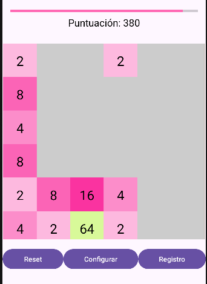

# 2048

-----

Juego del 2048 creado en equipo usando kotlin, sqlite y Jetpack Compose.

## Colaboradores

- [Aivhancho](https://github.com/Aivhancho)
- [leyrevelcas](https://github.com/leyrevelcas)
- [desmonHak](https://github.com/desmonHak)

El juego cuenta con botones de reset, configuracion de partida y registro de partida:

Al llegar a 2048, el juego se gana y se anota en el registro la victoria,
en ese caso, el juego se reinicia automaticamente, el mismo caso se da si no
queda mas movimientos que hacer debido a que el tablero fue llenado
completamente. En caso de perdes o reseat en plena partida, se anota una
perdida en el registro.

-----
